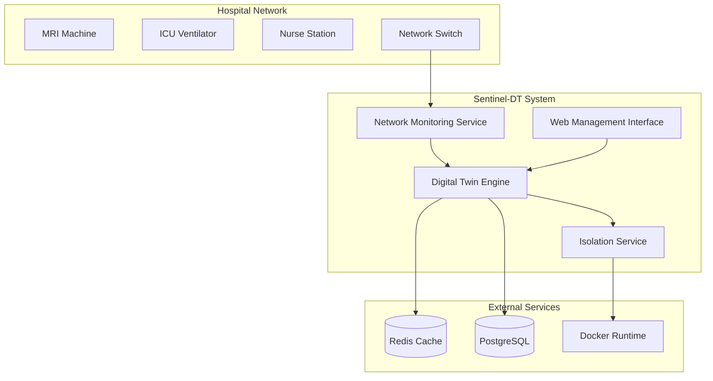

# Design Document: Sentinel-DT (Cyber Digital Twin for Healthcare)

## Overview

Sentinel-DT is a cybersecurity system that creates digital twins of medical devices to detect ransomware and unauthorized access in hospital networks. The system uses real-time network monitoring, behavioral analysis, and automated isolation to protect critical healthcare infrastructure while maintaining operational continuity.

The architecture follows a microservices pattern with three core components: a Network Monitoring Service for traffic capture, a Digital Twin Engine for state synchronization and behavioral modeling, and an Isolation Service for automated threat response. The system leverages machine learning for anomaly detection and containerized isolation for threat containment.

## Architecture

### High-Level Architecture



### Component Architecture

The system is designed as a distributed architecture with the following key principles:

1. **Separation of Concerns**: Each service handles a specific domain (monitoring, analysis, response)
2. **Asynchronous Communication**: Services communicate via message queues and WebSockets for real-time updates
3. **Scalable Processing**: Horizontal scaling support for handling multiple medical devices
4. **Fault Tolerance**: Graceful degradation when components fail, prioritizing medical device uptime

### Technology Stack

- **Network Monitoring**: Python with Scapy for packet capture and analysis
- **API Framework**: FastAPI for REST APIs and WebSocket communication
- **Machine Learning**: scikit-learn Isolation Forest for anomaly detection
- **Containerization**: Docker for service deployment and network isolation
- **Message Queue**: Redis for pub/sub messaging and caching
- **Database**: PostgreSQL for persistent storage of device profiles and audit logs
- **Frontend**: React-based web interface for system management

## Components and Interfaces

### Network Monitoring Service

**Purpose**: Captures and analyzes East-West network traffic to extract device telemetry.

**Key Responsibilities**:
- Real-time packet capture using Scapy's `sniff()` function with threading for non-blocking operation
- Traffic filtering to focus on medical device communications
- Header extraction and telemetry parsing
- Traffic pattern analysis for baseline establishment

**Interfaces**:
```python
class NetworkMonitoringService:
    async def start_monitoring(self, interfaces: List[str]) -> None
    async def stop_monitoring(self) -> None
    async def get_device_telemetry(self, device_id: str) -> DeviceTelemetry
    async def publish_telemetry_update(self, telemetry: DeviceTelemetry) -> None
```

**Implementation Details**:
- Uses multi-threading to separate packet capture from processing
- Implements packet filtering to reduce processing overhead
- Maintains circular buffers for recent traffic history
- Publishes telemetry updates to Redis pub/sub channels

### Digital Twin Engine

**Purpose**: Maintains virtual representations of medical devices and performs behavioral analysis.

**Key Responsibilities**:
- Synchronizes physical device state with digital twins every 500ms
- Maintains Digital Phenotypes (behavioral baselines) for device classes
- Performs anomaly detection using Isolation Forest
- Manages device lifecycle and state transitions

**Interfaces**:
```python
class DigitalTwinEngine:
    async def create_digital_twin(self, device: MedicalDevice) -> DigitalTwin
    async def synchronize_state(self, device_id: str, telemetry: DeviceTelemetry) -> None
    async def detect_anomalies(self, device_id: str) -> List[Anomaly]
    async def update_phenotype(self, device_class: str, behavioral_data: BehavioralData) -> None
```

**State Synchronization**:
- FastAPI WebSocket endpoints for real-time bidirectional communication
- Redis caching for fast state access and cross-service communication
- PostgreSQL for persistent storage of device configurations and historical data
- Automatic retry mechanisms for failed synchronization attempts

**Behavioral Analysis**:
- Isolation Forest model trained on normal device behavior patterns
- Separate models for each device class (MRI, Ventilator, Nurse Station)
- Continuous learning to adapt to legitimate operational changes
- Configurable sensitivity thresholds for different device criticality levels

### Isolation Service

**Purpose**: Provides automated network isolation for compromised devices.

**Key Responsibilities**:
- Receives anomaly alerts from Digital Twin Engine
- Evaluates threat severity and determines isolation necessity
- Executes Docker-based network quarantine procedures
- Maintains connectivity for non-compromised devices

**Interfaces**:
```python
class IsolationService:
    async def evaluate_threat(self, anomaly: Anomaly) -> ThreatAssessment
    async def isolate_device(self, device_id: str) -> IsolationResult
    async def restore_connectivity(self, device_id: str) -> RestoreResult
    async def get_isolation_status(self, device_id: str) -> IsolationStatus
```

**Docker Network Isolation**:
- Creates isolated Docker networks for quarantined devices
- Uses iptables rules for fine-grained traffic control
- Maintains separate network namespaces for each isolated device
- Implements network bridges for controlled communication paths

### Web Management Interface

**Purpose**: Provides administrative interface for system configuration and monitoring.

**Key Responsibilities**:
- Real-time dashboard showing system status and device health
- Configuration management for Digital Phenotypes and thresholds
- Audit log viewing and incident investigation tools
- User authentication and role-based access control

## Data Models

### Core Data Structures

```python
@dataclass
class MedicalDevice:
    device_id: str
    device_class: DeviceClass  # MRI, VENTILATOR, NURSE_STATION
    ip_address: str
    mac_address: str
    location: str
    criticality_level: CriticalityLevel
    last_seen: datetime
    status: DeviceStatus

@dataclass
class DeviceTelemetry:
    device_id: str
    timestamp: datetime
    network_metrics: NetworkMetrics
    behavioral_indicators: Dict[str, float]
    state_hash: str

@dataclass
class DigitalTwin:
    device_id: str
    current_state: DeviceState
    phenotype: DigitalPhenotype
    last_sync: datetime
    sync_status: SyncStatus
    anomaly_score: float

@dataclass
class DigitalPhenotype:
    device_class: DeviceClass
    baseline_metrics: Dict[str, StatisticalProfile]
    behavioral_patterns: List[BehavioralPattern]
    learning_period: timedelta
    confidence_level: float
    last_updated: datetime

@dataclass
class Anomaly:
    anomaly_id: str
    device_id: str
    detection_time: datetime
    anomaly_type: AnomalyType
    severity_score: float
    confidence: float
    affected_metrics: List[str]
    recommended_action: ResponseAction
```

### Database Schema

**Devices Table**:
- Stores medical device registration and configuration
- Includes device metadata, network information, and criticality levels
- Maintains device lifecycle status and location information

**Telemetry Table**:
- Time-series data for device network metrics and behavioral indicators
- Partitioned by device_id and timestamp for efficient querying
- Includes compressed storage for historical data retention

**Anomalies Table**:
- Records all detected anomalies with full context
- Links to specific devices and includes severity assessments
- Maintains audit trail for incident investigation

**Phenotypes Table**:
- Stores behavioral baselines for each device class
- Includes statistical profiles and pattern definitions
- Versioned to track phenotype evolution over time

## Correctness Properties

*A property is a characteristic or behavior that should hold true across all valid executions of a system—essentially, a formal statement about what the system should do. Properties serve as the bridge between human-readable specifications and machine-verifiable correctness guarantees.*

Before defining the correctness properties, I need to analyze the acceptance criteria from the requirements to determine which ones are testable as properties.

<function_calls>
<invoke name="prework">
<parameter name="featureName">sentinel-dt

Based on the prework analysis, I'll now define the consolidated correctness properties:

**Property 1: Network Traffic Monitoring Completeness**
*For any* active system configuration with designated network interfaces, all specified interfaces should be monitored and successfully capture East-West traffic without introducing network delays
**Validates: Requirements 1.1, 1.2, 1.4**

**Property 2: Telemetry Extraction Consistency**
*For any* captured network packet from a medical device, the system should extract properly formatted telemetry data suitable for digital twin synchronization
**Validates: Requirements 1.3**

**Property 3: Network Monitoring Error Recovery**
*For any* network capture failure, the system should log the error and attempt automatic recovery within the next monitoring cycle
**Validates: Requirements 1.5**

**Property 4: Synchronization Timing Compliance**
*For any* available telemetry data, the system should synchronize digital twin state with physical device telemetry every 500ms with API response times under 100ms
**Validates: Requirements 2.1, 2.5**

**Property 5: Digital Twin State Consistency**
*For any* successful synchronization event, the digital twin state should match the physical device telemetry and include a timestamp for audit purposes
**Validates: Requirements 2.2, 2.4**

**Property 6: Synchronization Retry Behavior**
*For any* failed synchronization attempt, the system should retry synchronization within the next 500ms cycle
**Validates: Requirements 2.3**

**Property 7: Digital Phenotype Lifecycle Management**
*For any* newly connected medical device, the system should establish a digital phenotype for its device class, collect behavioral data over the minimum learning period, and store baseline patterns for anomaly comparison
**Validates: Requirements 3.1, 3.3, 3.4**

**Property 8: Device Class Support Completeness**
*For any* medical device of type MRI, ICU Ventilator, or Nurse Station, the system should support creating and managing digital phenotypes for that device class
**Validates: Requirements 3.2**

**Property 9: Continuous Phenotype Refinement**
*For any* device operating normally over time, the system should continuously refine the digital phenotype accuracy based on observed behavioral patterns
**Validates: Requirements 3.5**

**Property 10: Desync Event Detection**
*For any* state mismatch between digital twin and physical device, the anomaly detector should identify this as a desync event using the Isolation Forest model
**Validates: Requirements 4.1, 4.2**

**Property 11: Behavioral Pattern Analysis**
*For any* anomaly detection analysis, the system should compare current behavior against established digital phenotypes and classify threat severity levels
**Validates: Requirements 4.3, 4.4**

**Property 12: Automated Response Triggering**
*For any* high-risk anomaly detection, the system should trigger automated response protocols immediately
**Validates: Requirements 4.5**

**Property 13: Selective Device Isolation**
*For any* high-risk anomaly detection, the isolation engine should quarantine only the affected medical device using Docker-based network isolation while maintaining connectivity for non-compromised devices
**Validates: Requirements 5.1, 5.2, 5.3**

**Property 14: Isolation Event Audit Trail**
*For any* active quarantine operation, the system should log all isolation events for security audit purposes
**Validates: Requirements 5.4**

**Property 15: Isolation Failure Handling**
*For any* failed isolation attempt, the system should alert administrators and attempt alternative containment measures
**Validates: Requirements 5.5**

**Property 16: High Availability During Incidents**
*For any* active security incident, non-infected nodes should maintain 99.9% network uptime with preserved connectivity for critical life-support systems
**Validates: Requirements 6.1, 6.2**

**Property 17: System Failover and Monitoring**
*For any* system component failure, the system should implement failover mechanisms while monitoring and reporting availability metrics in real-time
**Validates: Requirements 6.3, 6.4**

**Property 18: Medical Device Priority Handling**
*For any* availability drop below threshold, the system should prioritize medical device connectivity over security measures
**Validates: Requirements 6.5**

**Property 19: Detection-to-Isolation Latency**
*For any* anomaly detection event, the system should complete the detection-to-isolation loop within 2 seconds with immediate quarantine execution upon threat confirmation
**Validates: Requirements 7.1, 7.3**

**Property 20: Processing Efficiency and Monitoring**
*For any* telemetry data processing, the system should analyze patterns with minimal computational delay while maintaining response time metrics and alerting on threshold breaches
**Validates: Requirements 7.2, 7.4**

**Property 21: Load-Based Priority Management**
*For any* high system load condition, the system should prioritize critical threat responses over routine monitoring activities
**Validates: Requirements 7.5**

**Property 22: Concurrent Device Scalability**
*For any* system configuration, the system should support monitoring and protection of up to 50 concurrent virtualized medical nodes while maintaining performance standards across all devices
**Validates: Requirements 8.1, 8.2**

**Property 23: Automatic Device Onboarding**
*For any* newly added medical device, the system should automatically incorporate it into monitoring without manual configuration
**Validates: Requirements 8.3**

**Property 24: Resource Management and Load Balancing**
*For any* multi-node operation, the system should allocate resources efficiently and implement load balancing when resource limits are approached to maintain service quality
**Validates: Requirements 8.4, 8.5**

**Property 25: Comprehensive Security Event Logging**
*For any* security event occurrence, the system should log all detection, analysis, and response activities with timestamps, device identifiers, and threat classifications in tamper-evident format
**Validates: Requirements 9.1, 9.2, 9.3**

**Property 26: Incident Reporting and Log Integrity**
*For any* report generation request, the system should provide detailed incident timelines and response metrics while ensuring log integrity and preventing unauthorized modifications
**Validates: Requirements 9.4, 9.5**

**Property 27: Management Interface Authentication**
*For any* administrator access attempt to the web-based management interface, the system should authenticate users and enforce role-based permissions
**Validates: Requirements 10.2**

**Property 28: Configuration and Display Capabilities**
*For any* digital phenotype configuration request, the system should allow customization of behavioral baselines per device type while displaying real-time system status including monitored devices and threat levels
**Validates: Requirements 10.3, 10.4**

**Property 29: Alert Notification System**
*For any* system alert occurrence, the system should notify administrators through configurable notification channels
**Validates: Requirements 10.5**

## Error Handling

### Network Monitoring Errors
- **Packet Capture Failures**: Automatic interface recovery with exponential backoff
- **Permission Issues**: Graceful degradation with administrator alerts
- **Interface Unavailability**: Continuous monitoring for interface restoration

### Synchronization Errors
- **API Timeouts**: Retry with circuit breaker pattern to prevent cascade failures
- **Data Corruption**: Checksum validation and automatic data recovery
- **Network Partitions**: Local caching with eventual consistency when connectivity restores

### Machine Learning Errors
- **Model Training Failures**: Fallback to previous model version with alert generation
- **Insufficient Training Data**: Extended learning period with conservative thresholds
- **False Positive Management**: Adaptive threshold adjustment based on feedback

### Isolation Errors
- **Docker Runtime Failures**: Alternative isolation methods using iptables rules
- **Network Configuration Errors**: Rollback to previous known-good configuration
- **Resource Exhaustion**: Priority-based resource allocation for critical devices

### Database and Storage Errors
- **Connection Failures**: Connection pooling with automatic reconnection
- **Disk Space Issues**: Automated log rotation and data archival
- **Data Integrity Issues**: Backup restoration with integrity verification

## Testing Strategy

### Dual Testing Approach

The testing strategy employs both unit testing and property-based testing to ensure comprehensive coverage:

**Unit Tests**: Focus on specific examples, edge cases, and error conditions including:
- Specific device configuration scenarios
- Integration points between services
- Error handling for known failure modes
- API endpoint validation with concrete test cases

**Property Tests**: Verify universal properties across all inputs including:
- Network monitoring behavior across different traffic patterns
- Synchronization consistency across various device states
- Anomaly detection accuracy across behavioral variations
- Isolation effectiveness across different network topologies

### Property-Based Testing Configuration

**Testing Framework**: pytest with Hypothesis for Python-based property testing
**Minimum Iterations**: 100 iterations per property test to ensure statistical confidence
**Test Tagging**: Each property test references its design document property using the format:
```python
# Feature: sentinel-dt, Property 1: Network Traffic Monitoring Completeness
```

**Property Test Implementation Requirements**:
- Each correctness property must be implemented by a single property-based test
- Tests must generate realistic medical device network traffic patterns
- Anomaly detection tests must include both normal and malicious behavior patterns
- Isolation tests must verify network segmentation without affecting other devices
- Performance tests must validate latency and throughput requirements under load

### Integration Testing

**End-to-End Scenarios**:
- Complete attack simulation from initial compromise to isolation
- Multi-device scenarios testing scalability and resource management
- Failover testing with component failures during active incidents
- Performance testing under maximum supported device load (50 concurrent devices)

**Test Environment**:
- Containerized test environment mimicking hospital network topology
- Simulated medical devices with realistic traffic patterns
- Controlled anomaly injection for testing detection accuracy
- Network simulation tools for testing various network conditions